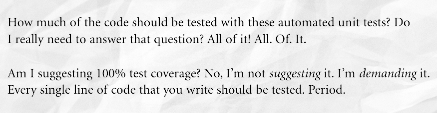
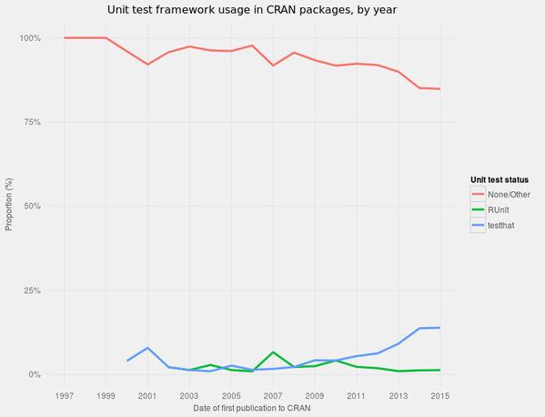

# Testing and code coverage 

(Carlos Peña)

## Overview
* [What is unit testing?](#what-is-unit-testing?)
* [Why testing?](#why-testing?)
* [Create unit tests](#create-unit-tests)
* Test-driven-development framework.


## What is unit testing?

From Wikipedia:
> In computer programming, **unit testing** is a software testing method by
> which individual units of source code, modules, usage procedures,
> and operating procedures, are tested to determine whether they are fit for use

The Clean Coder book by Uncle Bob:


What Uncle Bob has to say about testing?:



You got to be kidding me.


## Why testing?
Large programs will have many components, units, that will depend from other
modules. There is a risk that modifications of one unit will affect the
behavior of other units, or models.

At the end of the day, after a hard day of programming, you can run your
unit test and if all pass then you can go home without any worries.

Touching code I wrote year ago that doesn't have unit tests.


## A magical command for IPython
**autoreload**: IPython extension to reload modules before executing user code.

Usage:

```python
%load_ext autoreload
%autoreload 2
```

## Create unit tests
We will use this repository <https://github.com/carlosp420/testing_repo>:

* Go to Github, log in.
* Fork this repository <https://github.com/carlosp420/testing_repo>
* Grab the repository URL <https://github.com/YOUR_NAME_OR_USERNAME/testing_repo.git>
* Clone the repository in your computer:

```shell
git clone https://github.com/YOUR_NAME_OR_USERNAME/testing_repo
cd testing_repo
```

We need to install the wonderful libraries ``nose`` and ``coverage``. Useful for
unit testing.

```shell
sudo pip install nose
sudo pip install coverage
```

* Create one or more unit tests and save them to the file ``tests.py``
* Run the tests.

```shell
nosetests tests.py
```

* Write more tests. We always need more tests!
* Measure test coverage:

```shell
nosetests tests.py --with-coverage --cover-html
```

Most scientists do not use any testing framework for their code:


